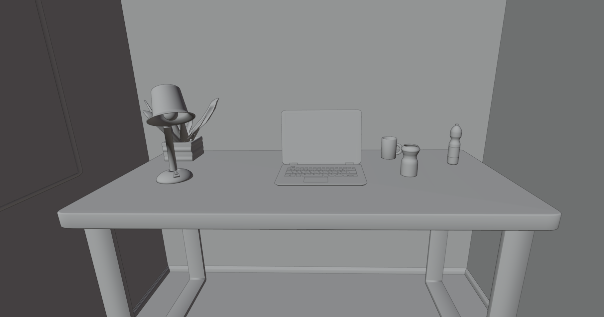

# VR Escape Room

## About

This repo contains a 3D model of a base escape room designed for a VR experience.

Note: The room model does not contain any textures

## Screenshots

## Usage

The room model is saved in the [`vr_escape_room.blend`](vr_escape_room.blend) file and can be opened with Blender.

## Items

The room contains the following items, among others, which can be used to create a puzzle:

- laptop
- screwdriver inside the cupboard
- lightswitch on the left side of the door
- card reader on the right side of the door

## Sample puzzles

The following room contains a sample escape room based the basic room model.
Some new models were added to the room.
A few puzzle elements are described in the following:

1. The clock on the desk behind the laptop screen displays a time that represents a code.

2. The texture of the wall displays a hidden coden when the light is turned off, and it is illuminated with a torch.

3. The card reader next to the door can be opened to short-circuit the internal cables with the screwdriver.

## License

This project is licensed under the GPLv3 License - see the [License](License) file for details.
